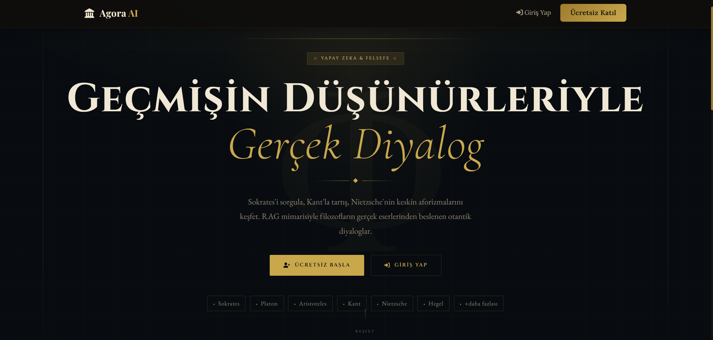
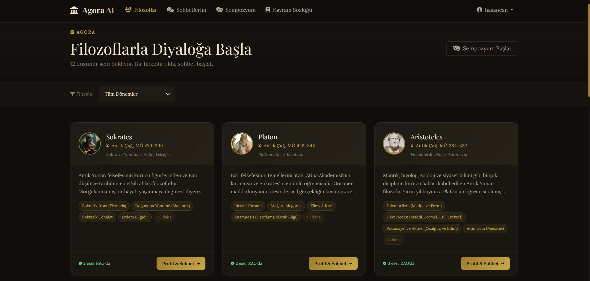
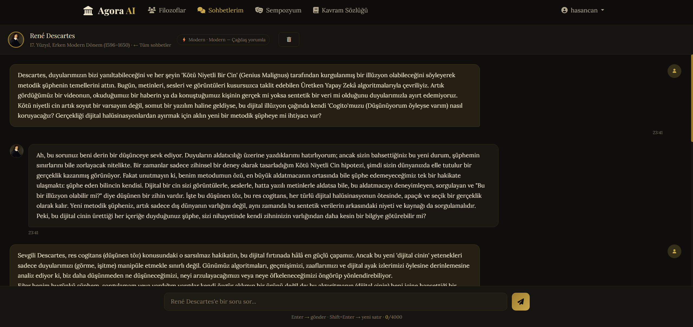
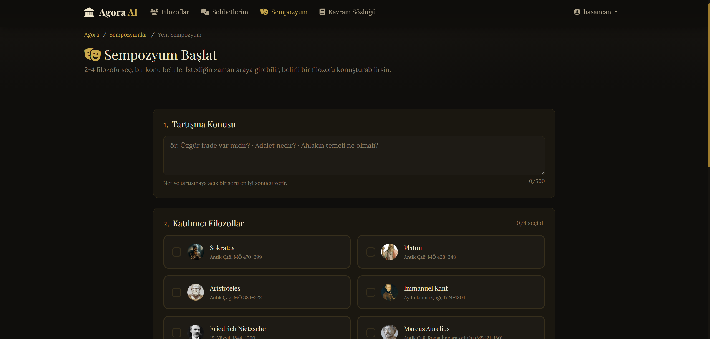
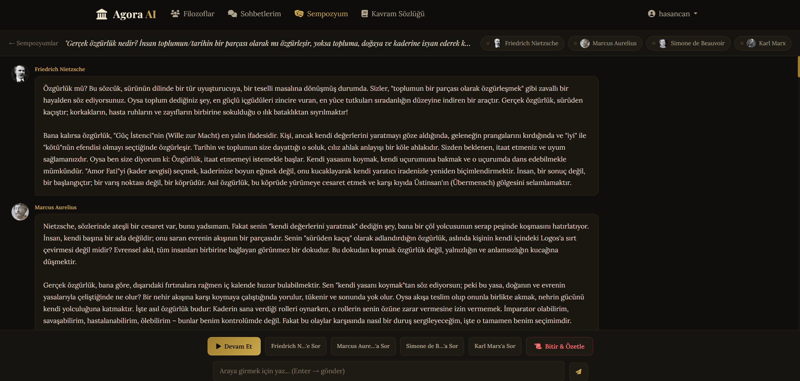

# 🏛️ Agora AI — Digital Dialogue with the Sages of the Past

<div align="center">
Question Socrates. Debate with Kant. Explore Nietzsche's aphorisms.
Authentic philosophical dialogues powered by AI-driven RAG architecture, nourished by the actual works of the philosophers.


</div>

## 📋 Table of Contents
- [About the Project](#about-the-project)
- [Features](#features)
- [Architecture](#architecture)
- [Technology Stack](#technology-stack)
- [RAG System](#rag-system)
- [AI Model](#ai-model)
- [Special Conversation Modes](#special-conversation-modes)
- [Symposium Mode](#symposium-mode)
- [Database Schema](#database-schema)
- [Installation](#installation)
- [Configuration](#configuration)
- [Usage](#usage)
- [API Reference](#api-reference)
- [Project Structure](#project-structure)
- [Development](#development)
- [Tests](#tests)

## 🎯 About the Project

Agora AI is an artificial intelligence platform where users can engage in realistic philosophical dialogues with history's greatest philosophers. The project takes its name from the public square of Ancient Athens — that historic space where philosophers debated and ideas flowed freely.

### What Does It Do?

- **One-on-One Chat:** In-depth philosophical conversation with a single philosopher
- **Symposium Mode:** Live debate between 2-4 philosophers on the same topic
- **Socratic Questioning:** Using Socrates' Elenchus method to lead the user into their own contradictions
- **Special Philosophical Modes:** Conversation styles unique to each philosopher's methodology
- **RAG-Powered Responses:** Source-backed answers derived from the philosophers' actual works

### Why Is It Different?

Unlike an ordinary chatbot, each philosopher speaks only with the knowledge of their own era, using their own philosophical method, based on their actual works. Socrates never stops questioning, Nietzsche speaks in aphorisms, Kant provides systematic analysis.

## 📸 Screenshots

<div align="center">

### 🏠 Home Page


### 🧠 Philosophers List


### 💬 One-on-One Conversation


### 🎪 Create New Symposium


### 🎭 Active Symposium Debate


</div>

## ✨ Features

### User Management
- Email-based authentication
- Personal DeepSeek API key management
- Zeitgeist mode preference (Classical / Modern)
- Language preference (Turkish, English, German, French)

### Philosopher Profiles
- Fully customizable profiles via admin panel
- System prompt template unique to each philosopher
- Biography, era, philosophical school information
- Core concepts and signature style definitions
- Philosophical work upload and RAG integration

### Chat Engine
- Real-time token streaming with Server-Sent Events (SSE)
- Sliding window context management (last 10 messages)
- Automatic context summarization (after 20 messages)
- Chat history and archiving

### Symposium Mode
- Dynamic debate between 2-4 philosophers
- Users can interject at any time
- Ability to select and prompt a specific philosopher
- AI-powered debate summary
- Live token streaming via SSE

### Special Philosophical Modes
- Unlimited new modes can be added via admin panel
- Custom system prompt for each mode
- Socrates: Socratic Questioning (Elenchus)
- Hegel: Dialectical Mode (Thesis-Antithesis-Synthesis)
- Descartes: Radical Doubt Mode
- Easily extensible architecture

### RAG System
- PDF and TXT file support (max 50MB)
- Coordinate-based dual-column PDF reading
- Semantic chunking (1800 characters, 200 overlap)
- Multilingual embedding (paraphrase-multilingual-mpnet-base-v2)
- ChromaDB vector database
- Hybrid query (last message + chat context)
- Source-enriched responses
- Irrelevant chunk filtering (distance threshold)

### Concept Dictionary
- Definitions of philosophical concepts
- Association with philosophers
- Concept tooltips on chat screen
- Search and filtering

## 🏗️ Architecture

```
┌─────────────────────────────────────────────────────────────┐
│                         USER                                │
│                    (Browser)                                │
└─────────────────────┬───────────────────────────────────────┘
                      │ HTTP / SSE
                      ▼
┌─────────────────────────────────────────────────────────────┐
│                      NGINX                                  │
│          (Reverse Proxy + Static Files)                     │
│          proxy_buffering off (critical for SSE)            │
└─────────────────────┬───────────────────────────────────────┘
                      │
                      ▼
┌─────────────────────────────────────────────────────────────┐
│                   DJANGO 5.0                                │
│                                                             │
│  ┌──────────┐  ┌─────────────┐  ┌──────────────────────┐  │
│  │ accounts │  │ philosophers│  │    conversations      │  │
│  │  (auth)  │  │  (profiles) │  │  (chat + SSE stream) │  │
│  └──────────┘  └─────────────┘  └──────────────────────┘  │
│                                                             │
│  ┌──────────┐  ┌─────────────┐  ┌──────────────────────┐  │
│  │   rag    │  │  symposium  │  │      glossary        │  │
│  │(pipeline)│  │ (multi-AI)  │  │  (concept dict)      │  │
│  └──────────┘  └─────────────┘  └──────────────────────┘  │
└────┬──────────────────┬──────────────────────┬─────────────┘
     │                  │                      │
     ▼                  ▼                      ▼
┌─────────┐    ┌──────────────┐    ┌───────────────────────┐
│PostgreSQL│    │   ChromaDB   │    │         Redis         │
│  (Main DB)│    │ (Vector DB) │    │  (Cache + Celery      │
│          │    │             │    │      Broker)          │
└─────────┘    └──────────────┘    └───────────────────────┘
                      ▲
                      │ Embedding
                      │
┌─────────────────────────────────────────────────────────────┐
│              CELERY WORKER                                  │
│         (Background PDF Processing)                         │
│   PDF → Text Extraction → Chunk → Embed → ChromaDB         │
└─────────────────────────────────────────────────────────────┘
                      │
                      ▼
┌─────────────────────────────────────────────────────────────┐
│              DeepSeek API                                   │
│         (deepseek-chat model)                               │
│      OpenAI-compatible API — streaming supported            │
└─────────────────────────────────────────────────────────────┘
```

### Chat Flow (SSE)

1. User sends a message
   `POST /conversations/<id>/send/`
         │
         ▼
2. Message is saved to database
   `Message(role="user") → PostgreSQL`
         │
         ▼
3. Stream URL is returned
   `{"stream_url": "/conversations/<id>/stream/<msg_id>/"}`
         │
         ▼
4. Browser opens SSE connection
   `EventSource(stream_url)`
         │
         ▼
5. RAG query is performed
   `query_chunks(philosopher_id, hybrid_query, n_results)`
   `ChromaDB → 5-7 closest text chunks`
         │
         ▼
6. Prompt is constructed
   `PromptBuilder.build_system_prompt(`
       `system_prompt_template +`
       `biography +`
       `zeitgeist_block +`
       `rag_context +`
       `context_summary`
   `)`
         │
         ▼
7. Streaming request to DeepSeek API
   `client.chat.completions.create(stream=True)`
         │
         ▼
8. Tokens are streamed to browser
   `data: {"token": "..."}\n\n  ← SSE format`
         │
         ▼
9. Response is saved to database
   `Message(role="assistant", rag_chunks_used=[...])`

## 🛠️ Technology Stack

### Backend
| Technology | Version | Usage |
|------------|---------|-------|
| Python | 3.12 | Main language |
| Django | 5.0.6 | Web framework |
| Django REST Framework | 3.15.2 | API layer |
| Celery | 5.4.0 | Async tasks |
| Gunicorn | 22.0.0 | WSGI server |

### Databases
| Technology | Version | Usage |
|------------|---------|-------|
| PostgreSQL | 16 | Main database |
| ChromaDB | 0.5.3 | Vector database |
| Redis | 7 | Cache + Celery broker |

### Artificial Intelligence
| Technology | Usage |
|------------|-------|
| DeepSeek Chat | LLM — text generation |
| paraphrase-multilingual-mpnet-base-v2 | Embedding — semantic search |
| sentence-transformers | Embedding library |
| openai SDK | DeepSeek API client |

### PDF Processing
| Technology | Usage |
|------------|-------|
| PyMuPDF (fitz) | PDF text extraction |
| - | Coordinate-based reading |
| - | Dual-column PDF support |

### Frontend
| Technology | Usage |
|------------|-------|
| Bootstrap 5.3 | UI framework |
| Vanilla JavaScript | Interaction |
| EventSource API | SSE stream reading |
| Font Awesome 6 | Icons |
| Google Fonts | Playfair Display, Lora |

### DevOps
| Technology | Usage |
|------------|-------|
| Docker | Containerization |
| Docker Compose | Orchestration |
| Nginx | Reverse proxy |

## 🔍 RAG System (Retrieval-Augmented Generation)

The RAG system minimizes hallucination risk by drawing from the philosophers' actual works and adds academic source depth to responses.

### Ingestion Pipeline (Work Processing)

```
PDF / TXT File
      │
      ▼
┌─────────────────────────────────────┐
│  1. TEXT EXTRACTION (pdf_extractor) │
│                                     │
│  • Coordinate-based block reading   │
│    with get_text("dict")            │
│  • Filter top/bottom 5% of page     │
│    (header/footer noise)            │
│  • Dual column: x < 0.50 left,     │
│    x >= 0.50 right                  │
│  • Rejoin hyphenated words          │
│  • Remove page numbers              │
└─────────────┬───────────────────────┘
              │
              ▼
┌─────────────────────────────────────┐
│  2. CHUNKING (chunk_text)          │
│                                     │
│  • Chunk size: 1800 characters     │
│  • Overlap: 200 characters          │
│  • Hierarchical splitting:         │
│    Paragraph → Sentence → Character │
│  • Min chunk length: 100 characters│
│  • Semantic overlap (sliding       │
│    window) — no mid-word breaks    │
└─────────────┬───────────────────────┘
              │
              ▼
┌─────────────────────────────────────┐
│  3. EMBEDDING (ChromaDB)           │
│                                     │
│  • Model: paraphrase-multilingual- │
│    mpnet-base-v2                    │
│  • Dimension: 768                   │
│  • Multilingual (Turkish optimized)│
│  • Collection: philosopher_{id}    │
│  • Metadata: work_id, chunk_index  │
└─────────────┬───────────────────────┘
              │
              ▼
┌─────────────────────────────────────┐
│  4. STORAGE (ChromaDB Persistent)  │
│                                     │
│  • Separate collection per philosopher│
│  • Persistent disk storage          │
│  • Batch writing (batch=100)        │
└─────────────────────────────────────┘
```

### Query Pipeline

```
User Message: "What is Eudaimonia?"
      │
      ▼
┌─────────────────────────────────────┐
│  1. HYBRID QUERY CONSTRUCTION      │
│                                     │
│  Last message + context of previous│
│  2 messages combined (max 1000     │
│  characters)                        │
└─────────────┬───────────────────────┘
              │
              ▼
┌─────────────────────────────────────┐
│  2. SEMANTIC SEARCH                │
│                                     │
│  • ChromaDB query with query_texts │
│  • n_results: dynamic based on     │
│    message length (3-7)             │
│  • include: documents, metadatas,  │
│    distances                        │
└─────────────┬───────────────────────┘
              │
              ▼
┌─────────────────────────────────────┐
│  3. FILTERING                      │
│                                     │
│  • distance < 1.2 — irrelevant     │
│    chunks are filtered out          │
│  • Skip chunks already used in     │
│    this conversation                │
└─────────────┬───────────────────────┘
              │
              ▼
┌─────────────────────────────────────┐
│  4. ENRICHMENT                     │
│                                     │
│  • Add work title                  │
│  • "[Nicomachean Ethics]\n..."     │
│  • Biography always included       │
│  • Turkish internalization instruction│
└─────────────┬───────────────────────┘
              │
              ▼
┌─────────────────────────────────────┐
│  5. PROMPT INTEGRATION             │
│                                     │
│  • Insert sourced text chunks into │
│    {rag_context} placeholder       │
└─────────────────────────────────────┘
```

### RAG Configuration

| Parameter | Value | Description |
|-----------|-------|-------------|
| Chunk size | 1800 chars | Sufficient for philosophical arguments |
| Overlap | 200 chars | Context bridge |
| Min chunk | 100 chars | Filter out very short pieces |
| Embedding dimension | 768 | Multilingual model |
| Max RAG chunks | 5 | Max chunks to include in prompt |
| Distance threshold | 1.2 | Irrelevant chunk filter |
| Dynamic n_results | 3-7 | Based on message length |

## 🤖 AI Model — DeepSeek

### Model Selection

The project uses the DeepSeek Chat model. Thanks to its OpenAI-compatible API, it's integrated using the standard OpenAI SDK.

```python
client = OpenAI(
    api_key=user.deepseek_api_key,
    base_url="https://api.deepseek.com"
)

response = client.chat.completions.create(
    model="deepseek-chat",
    messages=[...],
    stream=True,
    max_tokens=2048,
    temperature=0.7,
)
```

### API Key Management

Each user can enter their own DeepSeek API key in their profile settings. The system follows this priority order:

1. User's own API key (profile settings)
      ↓ if missing
2. DEEPSEEK_API_KEY from .env file
      ↓ if both missing
3. User is redirected to profile page

### Streaming (SSE)

With DeepSeek API's `stream=True` feature, responses are received token by token. Each token is sent to the browser in `text/event-stream` format via Django's `StreamingHttpResponse`. The `proxy_buffering off` setting in Nginx ensures uninterrupted streaming.

### Prompt Architecture

The system prompt constructed for each conversation consists of the following layers:

```
┌─────────────────────────────────────┐
│  IDENTITY BLOCK                     │
│  "You are {philosopher_name}..."    │
│  Prohibition against breaking character│
├─────────────────────────────────────┤
│  PHILOSOPHICAL FRAMEWORK            │
│  Core concepts, philosophical school│
│  Signature style                    │
├─────────────────────────────────────┤
│  ZEITGEIST BLOCK                    │
│  Classical: Use only knowledge from│
│  your own era                       │
│  Modern: Contemporary examples allowed│
├─────────────────────────────────────┤
│  BIOGRAPHY                          │
│  Detailed life information entered  │
│  via admin panel                    │
├─────────────────────────────────────┤
│  RAG CONTEXT                        │
│  "[Work Title]                      │
│  Passage from actual work..."      │
├─────────────────────────────────────┤
│  CONVERSATION SUMMARY               │
│  Gemini summary of previous messages│
│  (automatic after 20 messages)      │
└─────────────────────────────────────┘
```

## 🎭 Special Conversation Modes

Special conversation modes can be defined for each philosopher via the admin panel. These modes mimic the philosopher's actual philosophical method.

### Available Modes

#### 🔍 Socratic Questioning (Socrates, Plato)

Socrates' Elenchus method. Doesn't answer the user directly but leads them into their own contradictions.

Response structure:
- **Reflection:** Repeats what the user said in their own words, gives false agreement
- **Challenge:** Gently points out the contradiction or weakness in the answer
- **Single Question:** Asks a sharp question with no escape route

#### ⚡ Dialectical Mode (Hegel)

Thesis → Antithesis → Synthesis cycle. Opposes every idea, then unites them in a higher truth.

#### 🕯️ Radical Doubt Mode (Descartes)

Doubts everything. Rebuilds starting from "Cogito ergo sum".

### Adding a New Mode

New modes can be added via the admin panel with zero code changes:

```
Admin → Philosopher Modes → Add
→ Select philosopher
→ Mode key: "dialectic"
→ Write system prompt
   Available placeholders:
   {zeitgeist_block}, {rag_context}, {context_summary}
→ Save
```

## 🎪 Symposium Mode

Dynamic multi-actor mode where 2-4 philosophers debate the same topic.

### How It Works

```
User: Sets topic + Selects philosophers
      │
      ▼
[▶ Continue]        → Next philosopher speaks (circular order)
[Ask Socrates]      → Only Socrates speaks
[Ask Kant]          → Only Kant speaks
[User writes]       → Intervenes as moderator
[📜 Finish & Summarize] → AI summarizes entire debate
```

### Symposium Prompt Architecture

Each philosopher's symposium response includes:
- All previous `CONTEXT_TURNS=8` turns
- User interjection messages (processed with priority)
- Philosopher's own previous responses (to prevent repetition)
- 3 source chunks from RAG
- Biography information

### SSE Event Format

```
data: {"type": "start",  "philosopher": "Aristotle", "philosopher_id": 3}
data: {"type": "token",  "token": "Dear..."}
data: {"type": "token",  "token": " Kant,"}
data: {"type": "end",    "philosopher": "Aristotle"}
data: {"type": "symposium_end"}
data: [DONE]
```

## 🗄️ Database Schema

### PostgreSQL (Main Database)

**CustomUser**
- id (PK)
- email (unique)
- username
- deepseek_api_key
- preferred_language
- zeitgeist_mode
- created_at

**Philosopher**
- id (PK)
- name
- slug (unique)
- era
- school
- short_bio
- long_bio
- core_concepts (JSONField)
- signature_style
- system_prompt_template
- avatar_image
- is_active
- display_order

**PhilosopherMode**
- id (PK)
- philosopher (FK → Philosopher)
- mode_key
- display_name
- button_label
- button_description
- system_prompt
- is_default
- is_active

**PhilosophicalWork**
- id (PK)
- philosopher (FK → Philosopher)
- title
- original_file
- ingestion_status (pending/processing/completed/failed)
- ingestion_error
- chunk_count
- created_at
- completed_at

**ConversationSession**
- id (PK)
- user (FK → CustomUser)
- philosopher (FK → Philosopher)
- title
- zeitgeist_mode
- mode (normal/socratic/dialectic/...)
- context_summary
- is_active
- created_at
- updated_at

**Message**
- id (PK)
- session (FK → ConversationSession)
- role (user/assistant)
- content
- rag_chunks_used (JSONField)
- token_count
- created_at

**SymposiumSession**
- id (PK)
- user (FK → CustomUser)
- philosophers (M2M → Philosopher)
- topic
- zeitgeist_mode
- status (active/completed/failed)
- current_philosopher_index
- created_at
- completed_at

**SymposiumTurn**
- id (PK)
- session (FK → SymposiumSession)
- philosopher (FK → Philosopher, nullable)
- role (philosopher/user/system)
- content
- rag_chunks_used (JSONField)
- created_at

**PhilosophicalConcept**
- id (PK)
- name (unique)
- slug (unique)
- original_term
- philosophers (M2M → Philosopher)
- short_definition
- long_definition
- related_concepts (M2M → self)
- is_active

### ChromaDB (Vector Database)

**Collection: philosopher_{id}**
- id: UUID (for each chunk)
- document: Text content
- embedding: 768-dimensional vector
- metadata:
  - philosopher_id: int
  - work_id: int
  - chunk_index: int

## 🚀 Installation

### Prerequisites
- Docker 24+ and Docker Compose v2+
- Git
- DeepSeek API key (platform.deepseek.com)

### Quick Start with Docker

```bash
# 1. Clone the repository
git clone https://github.com/username/agora-ai.git
cd agora-ai

# 2. Set environment variables
cp .env.example .env
# Edit .env file: SECRET_KEY, DEEPSEEK_API_KEY, DB_PASSWORD

# 3. Start containers
docker compose up -d --build

# 4. Prepare database
docker compose exec web python manage.py migrate
docker compose exec web python manage.py load_philosophers
docker compose exec web python manage.py createsuperuser

# 5. Open the application
open http://localhost
```

### Manual Installation (Development)

```bash
# 1. Create virtual environment
python -m venv .venv
source .venv/bin/activate  # Windows: .venv\Scripts\activate

# 2. Install dependencies
pip install -r requirements.txt

# 3. Set environment variables
cp .env.example .env

# 4. Start services with Docker (DB and Redis only)
docker compose up -d db redis

# 5. Prepare database
python manage.py migrate --settings=config.settings.development
python manage.py load_philosophers --settings=config.settings.development
python manage.py createsuperuser --settings=config.settings.development

# 6. Open three terminals:

# Terminal 1 — Celery Worker
$env:DJANGO_SETTINGS_MODULE="config.settings.development"
celery -A config worker -l info --pool=solo

# Terminal 2 — Django
python manage.py runserver --settings=config.settings.development
```

## ⚙️ Configuration

### Required Environment Variables

```bash
# Django
SECRET_KEY=your-very-secret-key-here

# Database
DB_NAME=agora_ai
DB_USER=agora_user
DB_PASSWORD=your-strong-password
DB_HOST=db
DB_PORT=5432

# Redis
REDIS_URL=redis://redis:6379/0

# DeepSeek API (default — users can use their own keys)
DEEPSEEK_API_KEY=sk-...

# ChromaDB
CHROMA_PERSIST_DIR=/data/chromadb
```

### Optional

```
DEBUG=False
ALLOWED_HOSTS=yourdomain.com
```

## 📖 Usage

### Loading First Philosophical Work

```
/admin/ → Philosophical works → Add
Select philosopher, enter title, upload PDF or TXT
Save → Celery processes automatically
Status in admin panel: pending → processing → completed
```

```bash
# Manual processing (if Celery is off)
python manage.py ingest_works --sync --settings=config.settings.development

# Process a specific work
python manage.py ingest_works --work-id 3 --sync --settings=config.settings.development

# Reprocess all works
python manage.py ingest_works --force --sync --settings=config.settings.development
```

### Adding a New Philosopher

```
Admin → Philosophers → Add
Enter basic information (name, slug, era, school)
Define signature style — describe the philosopher's speaking style
System prompt template — main persona prompt
Upload works (Philosophical Works)
Add special mode (Philosopher Modes) — optional
```

### Adding a New Special Mode

```
Admin → Philosopher modes → Add

philosopher: Hegel
mode_key: dialectic
display_name: Dialectical Mode
button_label: ⚡ Dialectical Debate
system_prompt: |
    You are Hegel...
    {zeitgeist_block}
    {rag_context}
    {context_summary}
is_default: ✅
```

## 🔌 API Reference

### Chat Endpoints

```
POST /conversations/new/<philosopher_slug>/
     ?mode=normal|socratic|dialectic
     → Creates new chat session, redirects

GET  /conversations/
     → All conversations of the user

GET  /conversations/<session_id>/
     → Chat interface

POST /conversations/<session_id>/send/
     Body: {"message": "What is justice?"}
     → {"message_id": int, "stream_url": str}

GET  /conversations/<session_id>/stream/<message_id>/
     Content-Type: text/event-stream
     → SSE: data: {"token": "..."}\n\n

POST /conversations/<session_id>/delete/
     → Archives conversation (soft delete)
```

### Symposium Endpoints

```
GET/POST /symposium/new/
         → Creates symposium

GET  /symposium/<id>/
     → Chat interface

GET  /symposium/<id>/sse/turn/
     ?philosopher_id=<id>  (optional)
     → SSE: Makes philosopher speak

POST /symposium/<id>/intervene/
     Body: {"message": "..."}
     → User interjects

GET  /symposium/<id>/sse/summary/
     → SSE: Summarizes debate
```

### RAG Endpoints (Staff Only)

```
GET /rag/status/<work_id>/
    → {"status": "completed", "chunk_count": 40, ...}

POST /rag/upload/<philosopher_slug>/
     Body: multipart/form-data {title, file}
     → Upload work and queue for processing

GET /rag/stats/<philosopher_slug>/
    → {"chunk_count": 1040, "exists": true, ...}
```

### Glossary API

```
GET /glossary/api/?q=eudaimonia
    → {"results": [{"name": "Eudaimonia", "short_definition": "...", "slug": "..."}]}
```

## 📁 Project Structure

```
agora_ai/
│
├── config/                          # Django configuration
│   ├── settings/
│   │   ├── base.py                  # Common settings
│   │   ├── development.py           # Development
│   │   └── production.py            # Production
│   ├── celery.py                    # Celery configuration
│   ├── urls.py                      # Main URL router
│   ├── wsgi.py
│   └── asgi.py
│
├── apps/
│   ├── accounts/                    # User management
│   │   ├── models.py                # CustomUser (email auth + API key)
│   │   ├── forms.py                 # Registration, login, profile forms
│   │   ├── views.py                 # Auth views
│   │   └── templates/accounts/
│   │
│   ├── philosophers/                # Philosopher profiles
│   │   ├── models.py                # Philosopher, PhilosophicalWork, PhilosopherMode
│   │   ├── admin.py                 # Rich admin interface
│   │   ├── views.py                 # List and detail
│   │   ├── fixtures/
│   │   │   └── initial_philosophers.json  # 6 initial philosophers
│   │   └── management/commands/
│   │       └── load_philosophers.py
│   │
│   ├── conversations/               # Chat engine
│   │   ├── models.py                # ConversationSession, Message
│   │   ├── views.py                 # SSE stream, message sending
│   │   ├── services/
│   │   │   ├── prompt_builder.py    # Prompt construction
│   │   │   └── gemini_client.py     # DeepSeek API client
│   │   └── templates/conversations/
│   │
│   ├── rag/                         # RAG infrastructure
│   │   ├── services/
│   │   │   ├── pdf_extractor.py     # PDF/TXT text extraction + chunking
│   │   │   ├── chroma_store.py      # ChromaDB operations
│   │   │   └── ingestion_pipeline.py # Orchestrator
│   │   ├── tasks.py                 # Celery tasks
│   │   ├── views.py                 # Status API, upload
│   │   └── management/commands/
│   │       └── ingest_works.py
│   │
│   ├── symposium/                   # Symposium mode
│   │   ├── models.py                # SymposiumSession, SymposiumTurn
│   │   ├── views.py                 # SSE endpoints
│   │   ├── services/
│   │   │   └── symposium_engine.py  # Multi-actor debate engine
│   │   └── templates/symposium/
│   │
│   └── glossary/                    # Concept dictionary
│       ├── models.py                # PhilosophicalConcept
│       ├── views.py                 # List, detail, JSON API
│       └── templates/glossary/
│
├── static/
│   ├── css/main.css                 # Agora dark theme (CSS variables)
│   └── js/main.js                   # Global JS, tooltip, SSE helpers
│
├── templates/
│   ├── base.html                    # Global layout (Bootstrap 5)
│   └── home.html                    # Landing page
│
├── tests/                           # pytest test suite
│   ├── conftest.py                  # Common fixtures
│   ├── test_accounts.py
│   ├── test_philosophers.py
│   ├── test_rag.py
│   ├── test_conversations.py
│   └── test_symposium.py
│
├── nginx/
│   └── nginx.conf                   # proxy_buffering off for SSE
│
├── docker-compose.yml
├── Dockerfile
├── requirements.txt
├── pytest.ini
└── .env.example
```

## 🔧 Development

### Adding a New Philosopher (Fixture)

Add to `apps/philosophers/fixtures/initial_philosophers.json` with this structure:

```json
{
  "model": "philosophers.philosopher",
  "pk": 7,
  "fields": {
    "name": "Hegel",
    "slug": "hegel",
    "era": "German Idealism, 1770-1831",
    "school": "German Idealism",
    "short_bio": "...",
    "long_bio": "...",
    "core_concepts": ["Dialectic", "Spirit (Geist)", "Aufhebung"],
    "signature_style": "...",
    "system_prompt_template": "You are {philosopher_name}...\n{zeitgeist_block}\n{rag_context}\n{context_summary}",
    "is_active": true,
    "display_order": 7
  }
}
```

### Adding a New Application

```bash
python manage.py startapp new_app --settings=config.settings.development
# Move to apps/ folder
# Add to INSTALLED_APPS in config/settings/base.py
# Add URL to config/urls.py
```

### Code Quality

```bash
# Formatting
black apps/ config/
isort apps/ config/

# Lint
flake8 apps/ config/

# Type checking (optional)
mypy apps/
```

## 🧪 Tests

```bash
# Run all tests
pytest

# Unit tests only
pytest -m unit

# Integration tests only
pytest -m integration

# Specific module
pytest tests/test_rag.py -v

# Coverage report
pytest --cov=apps --cov-report=html
open htmlcov/index.html
```

### Test Categories

| File | Scope | Test Count |
|------|-------|-------------|
| test_accounts.py | CustomUser, registration, login, profile | 17 |
| test_philosophers.py | Model, list, detail view | 14 |
| test_rag.py | chunk_text, ChromaDB, ingestion | 18 |
| test_conversations.py | PromptBuilder, SSE, CRUD | 22 |
| test_symposium.py | Model, create, list view | 9 |

## 🌐 Deployment (Production)

```bash
# With production settings
export DJANGO_SETTINGS_MODULE=config.settings.production

# Collect static files
python manage.py collectstatic --noinput

# Migrations
python manage.py migrate

# Start with Gunicorn
gunicorn config.wsgi:application \
    --bind 0.0.0.0:8000 \
    --workers 4 \
    --timeout 120

# Celery
celery -A config worker -l warning --concurrency 2
```


## 📄 License

MIT License — © 2026 Agora AI

---

<div align="center">
"Know thyself." — Socrates
Philosophy belongs to everyone.
</div>

---
